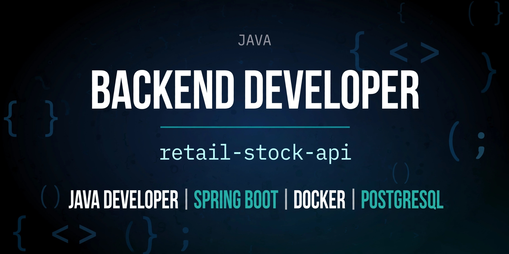
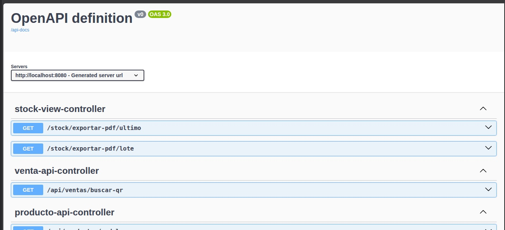
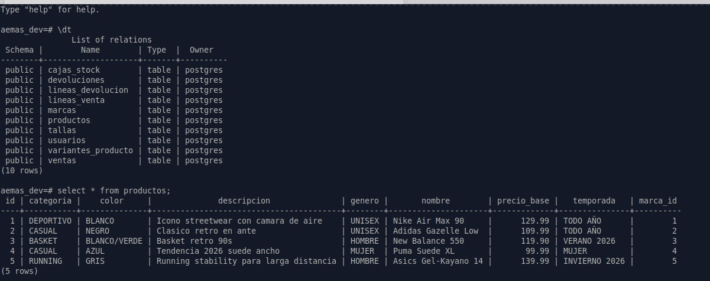
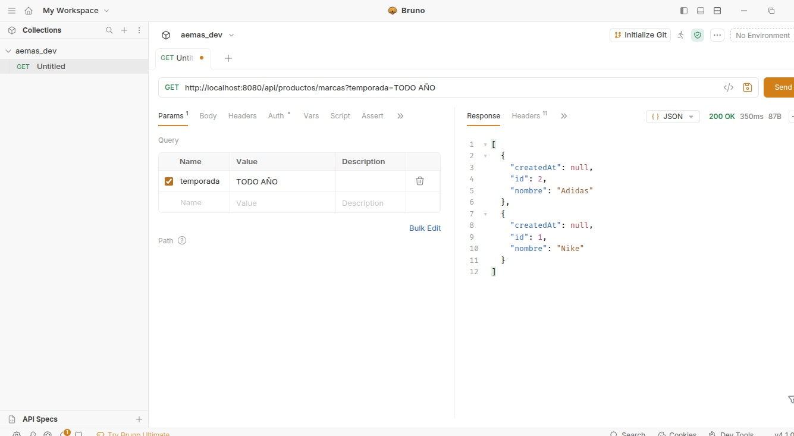
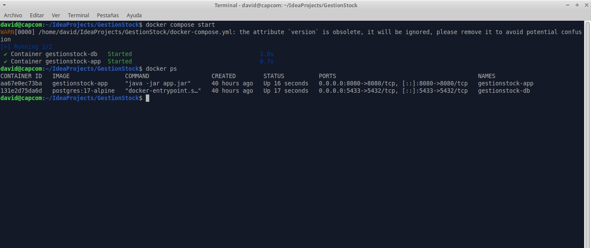
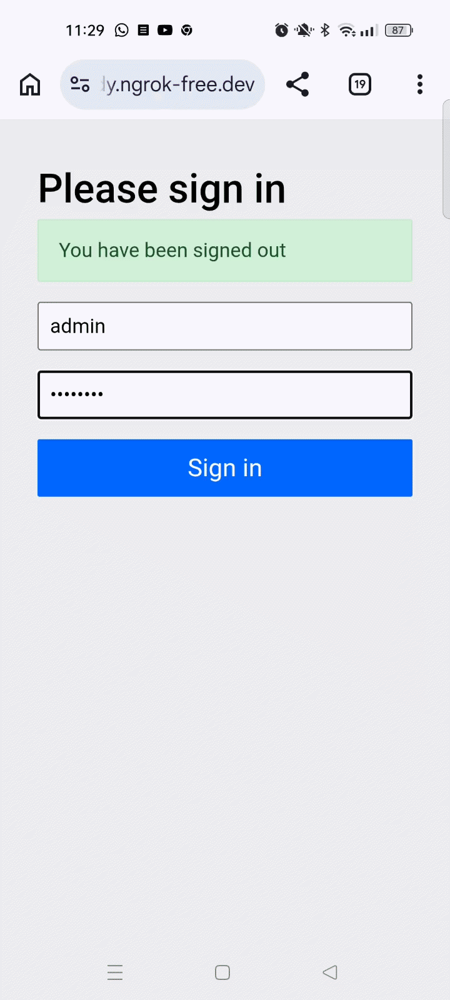
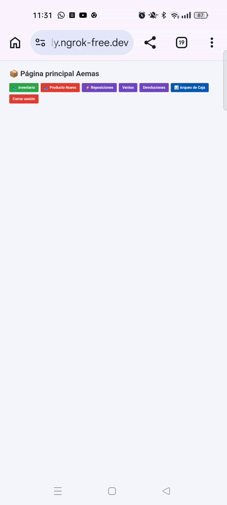

# retail-stock-api

[](https://openjdk.org/)
[](https://spring.io/)
[](https://www.postgresql.org/)
[](https://www.docker.com/)
[-green?style=flat)]()

> 🟢 **Estado del proyecto:** Aplicación en **desarrollo activo**, totalmente **funcional y operativa** para la gestión diaria de inventario, ventas, devoluciones y cierres de caja en entorno retail real.

---
## 🛠️ Arquitectura del Sistema

**retail-stock-api** es una **aplicación web monolítica híbrida** desarrollada con **Spring Boot 3** que combina el patrón **MVC** tradicional con una **API REST**:

* **Arquitectura General:** Arquitectura por capas (Controladores, Servicios, Repositorios, Modelo).
* **Renderizado en Servidor (MVC):** Vistas dinámicas basadas en **Thymeleaf** para la navegación web y formularios tradicionales.
* **API REST:** Endpoints en formato **JSON** (`/api/...`) consumidos asíncronamente mediante `Fetch API` desde el cliente para operaciones en tiempo real (ej. lectura de códigos QR con cámara web mediante la integración de `html5-qrcode`).
* **Persistencia de Datos:** **Spring Data JPA / Hibernate** sobre **PostgreSQL 17** gestionando relaciones multidominio (`@ManyToOne`, `@OneToMany`) y transacciones financieras.
* **Infraestructura:** Despliegue mediante contenedores **Docker / Docker Compose** e integración de **ngrok** para tunelización HTTPS en pruebas remotas con dispositivos móviles.

---

## ✨ Características Principales

* **Control de Stock y Trazabilidad:** Gestión de productos, variantes (tallas/colores) y cajas físicas identificadas individualmente por **código QR único**.
* **Punto de Venta / Escáner QR:** Módulo asíncrono para registro instantáneo de ventas y devoluciones mediante cámara.
* **📊 Arqueo y Cierre de Caja (Cuadre Diario):**
    * Cálculo en tiempo real del balance neto (Ingresos por ventas - Devoluciones abonadas).
    * Desglose minucioso por rango de fechas (conteo total de pares vendidos y devueltos).
    * **Trazabilidad unitaria:** Listado detallado de cada par afectado en el arqueo, mostrando código QR, producto, talla e importe abonado/cobrado.
* **Seguridad y Perfiles:** Control de acceso mediante Spring Security y configuración segura multi-entorno.

---

## 🏗️ Configuración de Perfiles y Seguridad

El proyecto utiliza **Spring Profiles** y variables de entorno para evitar la filtración de credenciales en el repositorio:

- `application.properties` - Configuración base pública.
- `application-dev.properties` - Entorno de desarrollo local (gitignored).
- `application-prod.properties` - Entorno de producción (gitignored).

*Nota: Se incluyen plantillas `*-example.properties` y `.env.example` para facilitar la configuración inicial.*

---
### ⚙️ Cómo ejecutarlo en local

```bash
# 1. Clonar el repositorio
git clone https://github.com/drojas77/retail-stock-api.git
cd retail-stock-api

# 2. Copiar variables de entorno
cp .env.example .env

# 3. Compilar y levantar contenedores
./mvnw clean package -DskipTests
docker compose down -v
docker compose up --build
```

Acceso a los servicios:
- Aplicación Web: `http://localhost:8080`
- Credenciales por defecto: `admin / admin123`
- Gestión de Stock: `http://localhost:8080/stock/ver`
- Arqueo de Caja: `http://localhost:8080/arqueo`
- Documentación Swagger: `http://localhost:8080/swagger-ui.html`

📌 Endpoints principales
- `POST /ventas/procesar` - Marca caja como VENDIDO
- `POST /devoluciones/procesar` - Devuelve a DISPONIBLE
- `GET /stock/ver` - Pantalla inventario
- `GET /api/productos/marcas` - Lista marcas
- `GET /arqueo` - Vista MVC del balance contable y desglose de pares según fechas elegidas.

---
## 🧪 Pruebas Unitarias y Cobertura

El proyecto cuenta con una suite de pruebas unitarias desarrolladas con **JUnit 5** y **Mockito** para validar la lógica de negocio y asegurar la estabilidad de las operaciones principales de la tienda sin depender de una base de datos activa.

### Cobertura de Tests

* **`VentaServiceTest`**:
    * Registro de ventas en caja y actualización de estados del stock (`DISPONIBLE` $\rightarrow$ `VENDIDO`)[cite: 5].
    * Validación de cálculo del total acumulado y asignación del método de pago[cite: 5].
    * Manejo de excepciones ante listas nulas/vacías o intentos de vender cajas que no están disponibles o no existen[cite: 5].
* **`ArqueoServiceTest`**:
    * Cálculo del balance neto de caja (Ingresos por ventas - Importe por devoluciones)[cite: 7].
    * Conteo exacto de pares vendidos y pares devueltos en rangos de fechas concretos[cite: 7].
    * Gestión de arqueos diarios vacíos (retorno seguro con valores a cero)[cite: 7].
* **`StockViewServiceTest`**:
    * Verificación de la presencia física de stock mediante escaneo de códigos QR únicos[cite: 6].

---

### Ejecución de Pruebas

Para ejecutar la suite completa de pruebas unitarias desde la consola o terminal:

```bash
./mvnw test
```

📦 Datos de ejemplo incluidos (first-run automático)

Al arrancar con perfil `dev`, `data.sql` carga automáticamente:

- 5 marcas (Nike, Adidas, New Balance, Puma, Asics)
- 7 tallas (39-45)
- 5 productos de calzado
- 9 variantes con SKU (ej: NIK-AM90-WHT-40)
- 8 cajas de stock con QR único `QR-SKU-XXXXXXXXX`, estado y ubicación (A1-01-01, etc.)

Todo se crea en el primer `docker compose up --build`. Sin carga manual.

Si quieres BBDD vacía: `spring.sql.init.mode=never` en `application-dev.properties`

**Swagger/Endpoints**


**Base de Datos**


**Bruno haciendo un GET**


**Docker corriendo**


<p align="center">
  
  &nbsp;&nbsp;&nbsp;
  
</p>


👨‍💻 Autor
David Rojas - Desarrollador Backend
https://www.linkedin.com/in/david-rojas-herrera

Java Developer | Spring Boot | Docker | PostgreSQL